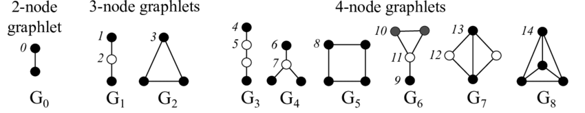

# Your Project Title

## Proposed Solution

### Parallelization of Counting Graphlet Algorithm

This project focuses on parallelizing the graphlet counting algorithm using HIP, and examining its effect on the Weisfeiler-Lehman kernel. Parallelization helps to enhance performance by efficiently counting graphlets.

#### Key Steps:
1. **Graphlet G1**: Counted directly from node combinations as a base case.
2. **Graphlet G2**: Derived from G1, reducing redundant calculations.
3. **Graphlet G3**: Identifies an edge with two isolated nodes, ensuring accurate counts by dividing by 2.
4. **Graphlet G4**: Represents a star graph, corrected for overcounts by dividing by 3.
5. **Graphlet G5**: Counts 4-node square cycles, adjusted by dividing by 4.
6. **Graphlet G6**: Counts triangles with an additional node.
7. **Graphlet G7**: Consists of two edges sharing a node, forming a triangle, with counts divided by 2.
8. **Graphlet G8**: Complete graphs on four nodes, adjusted for permutations by dividing by 4.

### Results (graph.txt file)
- **G1 Count**: 3742
- **G2 Count**: 128
- **G3 Count**: 7876
- **G4 Count**: 4697
- **G5 Count**: 78
- **G6 Count**: 955
- **G7 Count**: 56
- **G8 Count**: 6

Pre-processing the data ensures immediate results for graphlet counts, emphasizing the efficiency of the parallelization process.
