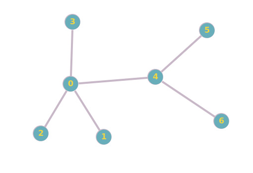

# Combination Based Graphlet Counting for Parallelism

## Proposed Solution

### Parallelization of Counting Graphlet Algorithm

This project focuses on parallelizing the graphlet counting algorithm using HIP.
Parallelization helps to enhance performance by efficiently counting graphlets. 
Here is how:

### How Parallesim Works by an Example Case

Main goal is finding G1 graphlets and G2 Graphlets
 
So G3 to G8 counters can be implemented with those combinations.

Run combination_gen_hip.cpp file in order to get combination write them into 3 node combinations bin file.

For example we have 7 seven node graph: graph ss is above.

combination (7/3) is 35. 5 different 3 node combinations.
these are code indexes.

5 6 7 //thread 0 will check wheather node 5 6 7 is a G1

4 5 7 //thread 1 will check wheather node 4 5 7 is a G1

4 5 6 // ...

4 6 7  

3 4 7 

3 4 6 

3 4 5 

3 5 7 

3 5 6 

3 6 7 

2 3 7 

2 3 6 

2 3 5

2 3 4

2 4 7

2 4 6

2 4 5

2 5 7 

2 5 6 

2 6 7 

1 2 7 

1 2 6 

1 2 5 

1 2 4 

1 2 3 

1 3 7 

1 3 6 

1 3 5 

1 3 4 

1 4 7 

1 4 6 

1 4 5 

1 5 7 

1 5 6 

1 6 7 //thread 34 will check wheather node 1 6 7 is a G1

leads to 

G1:there are 8

2 0 1

2 0 3

2 0 4

1 0 3

1 0 4

3 0 4

0 4 5

0 4 6

write combinations into G1 combs.bin file

G2:There is 0

G3-G4-G5 counter:

first step: getcombinations from G1 combs.bin file

second step iterate kernels number of node times (in this case 7)

Frist iteration:

2 0 1 // thread 0 will check 2 0 1 0 

2 0 3 // thread 1 will check 2 0 3 0

2 0 4 // thread 2 will check 2 0 4 0

1 0 3 // thread 3 will check 1 0 3 0

1 0 4

3 0 4

0 4 5

0 4 6 // thread 7 will check 0 4 6 0

Second iteration

2 0 1 // thread 0 will check 2 0 1 1 

2 0 3 // thread 1 will check 2 0 3 1

2 0 4 // thread 2 will check 2 0 4 1

1 0 3 // thread 3 will check 1 0 3 1

1 0 4

3 0 4

0 4 5

0 4 6 // thread 7 will check 0 4 6 1

Third iteration

all same only last check elemnt is 2

...

This logic finds all G3 but same graphlet counted several times.

forG3:
2 0 4//0 4 6 are sub graph of same G3(2 0 4 6)
same graphlet will be counted 2 times. So we divide by 2 final count integer.
for G4: 
(2 0 1///2 0 3///1 0 3) three node combinations are part of same G4(2 0 1 3). Same graph will be counted
3 times every time. So we divide by 3 final count integer.

for G5 
with same logic counted 4 times so divede by 4

#### Key Steps:
1. **Graphlet G1**: Counted directly from node combinations as a base case.
2. **Graphlet G2**: Derived from G1, reducing redundant calculations.
3. **Graphlet G3**: Identifies an edge with two isolated nodes, ensuring accurate counts by dividing by 2.
4. **Graphlet G4**: Represents a star graph, corrected for overcounts by dividing by 3.
5. **Graphlet G5**: Counts 4-node square cycles, adjusted by dividing by 4.
6. **Graphlet G6**: Counts triangles with an additional node.
7. **Graphlet G7**: Consists of two edges sharing a node, forming a triangle, with counts divided by 2.
8. **Graphlet G8**: Complete graphs on four nodes, adjusted for permutations by dividing by 4.

### Results (graph.txt file)
- **G1 Count**: 3742
- **G2 Count**: 128
- **G3 Count**: 7876
- **G4 Count**: 4697
- **G5 Count**: 78
- **G6 Count**: 955
- **G7 Count**: 56
- **G8 Count**: 6

Pre-processing the data ensures immediate results for graphlet counts, emphasizing the efficiency of the parallelization process.
